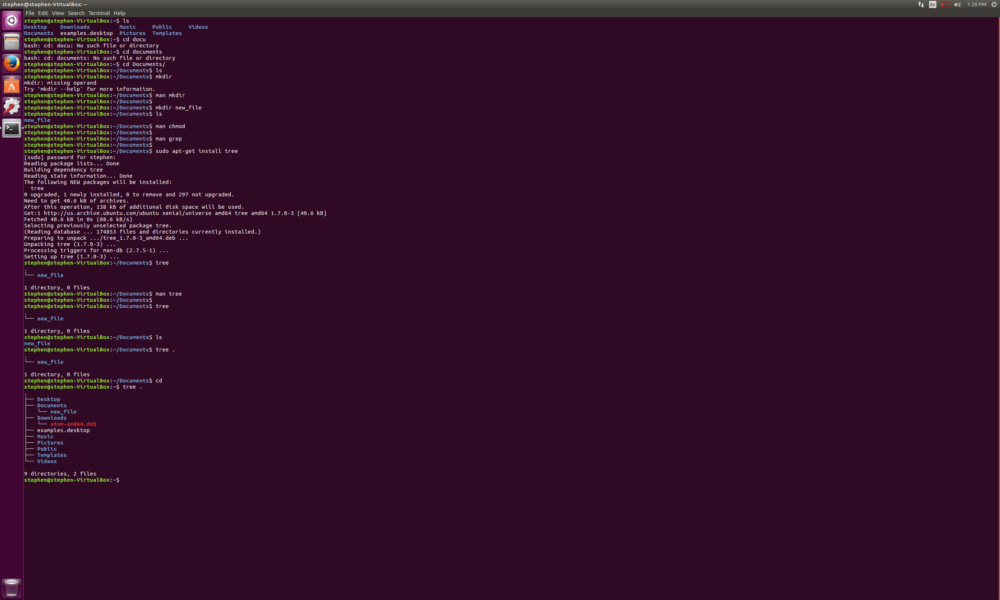

## Asking and Answering Questions
1. Make sure that if you find the answer to a question or are able to answer the question, make that answer as public as possible.  This can be done by having the person originally posting adding the answer to the original question post.  This will make this question easier to search for and have the answer publicly available.
2. If you are answering a question that involves code, provide examples or snippets of code that are well formatted and clearly display the language that is being used.  Many languages can look similar, and providing if an answer is in C++, C#, or C will be very helpful to someone looking for answers.

##Response to Free Culture
Jesse Jordan's story about developing a search engine to scour RPI's network for files hosted by other students is interesting because it shows that Open Source is still misunderstood.  Jesse's goal was to just tinker with something that he was interested in and gain some experience, but this ended with him having to pay $12,000 to the RIAA. This is unfortunate in my eyes, because seeing this is discouraging to anyone who wants to tinker with and modify programs.  What Jesse did was a public service to RPI students allowing them to access files from school computers or away locations with ease.  However if every person who wants to modify a piece of code is subject to a copyright lawsuit, nothing will ever improve.  Jesse did not condone or encourage piracy, yet was sued for it non the less.  He did not upload the files for others to download and share illegally.  This also shows the nature of the RIAA, in that the amount of money did not matter to them, just that they destroyed Jesse's reputation and gave him a hard time.

##Tree

##Regex

##Blockly

##Reflection
For my project I wanted to make something that was useful to me and potentially others.  One of my hobbies is video games, and I would like to make a tool or program that adds a feature to the game that is not supported by default.  Currently I am not sure what this program would do, but I am determined to create something because I will actually be able to use this tool frequently and potentially have others contribute to make it better.  There are plenty of examples of open source programs that work on games, and are developed by community members, so this is already a good sign that there is a community dedicated to developing software for games.  To make things easier I will try to find a game that supports an API to interact with the game.  This is for two reasons, generally if there is no official API, the developers do not want you to develop third party software.  Second, this will make the implementation of the project easier and it will be documented and have support by the developers of the game itself.
